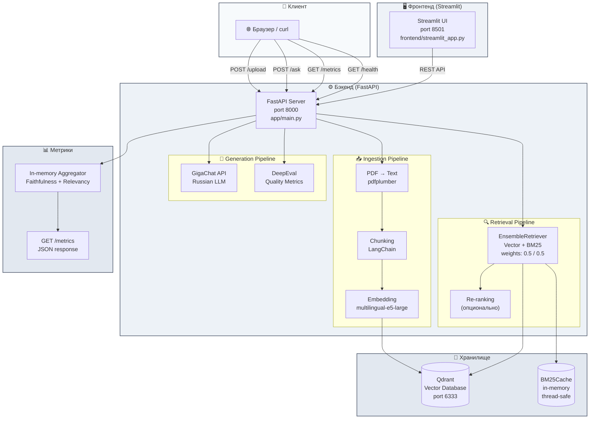

# Contract Analyzer AI

<p align="center">
  <a href="http://176.108.252.198:8501">
    
  </a>
  <a href="http://176.108.252.198:8000/docs">
    
  </a>
  <a href="https://github.com/appdataguru-hub/contract-analyzer-ai">
    
  </a>
</p>

<p align="center">
  
  
  
  
  
  
</p>

---

**Contract Analyzer AI** — гибридная RAG-система для анализа PDF-договоров с поддержкой русского языка через GigaChat.

Загрузите PDF-договор, задавайте вопросы на естественном языке и получайте ответы от ИИ с оценкой качества в реальном времени (Faithfulness + Answer Relevancy). Стек: FastAPI, Qdrant, LangChain, GigaChat.

📋 **Полный QA-отчёт:** [docs/QA_AUDIT_REPORT.md](docs/QA_AUDIT_REPORT.md) — 11 багов найдено и исправлено, улучшения архитектуры, статистика тестов.

---

## 🌐 Демо

Проект доступен для тестирования в реальном времени:

| Сервис | Ссылка |
|--------|--------|
| **🚀 Фронтенд (Streamlit)** | [http://176.108.252.198:8501](http://176.108.252.156:8501) |
| **⚙️ Бэкенд API** | [http://176.108.252.198:8000](http://176.108.252.156:8000) |
| **📚 Swagger UI** | [http://176.108.252.198:8000/docs](http://176.108.252.156:8000/docs) |
| **💚 Health Check** | [http://176.108.252.198:8000/health](http://176.108.252.156:8000/health) |
| **📊 Метрики** | [http://176.108.252.198:8000/metrics](http://176.108.252.156:8000/metrics) |

> ⚠️ **Внимание:** Демо развёрнуто на тестовой VM и может быть недоступно в случае остановки сервера. Для локального запуска используйте [инструкцию по установке](#-установка-и-настройка).

---

## 🏗️ Архитектура



### Компоненты

| Компонент | Технология | Назначение |
|-----------|-----------|-----------|
| **API** | FastAPI + Uvicorn | 5 эндпоинтов: upload, ask, evaluate, metrics, health |
| **Ingestion** | pdfplumber, LangChain | Извлечение текста, чанкинг, векторизация |
| **Vector DB** | Qdrant | Хранение и поиск эмбеддингов |
| **Embeddings** | multilingual-e5-large (HuggingFace) | Семантические векторы текста |
| **Retrieval** | EnsembleRetriever (Vector + BM25) + BM25Cache | Гибридный поиск с кэшированием |
| **Generation** | GigaChat API | Формирование ответа на русском |
| **Evaluation** | DeepEval (Faithfulness + Answer Relevancy) | Оценка качества каждого ответа |
| **Metrics** | In-memory агрегатор + REST endpoint | Живые агрегированные метрики |
| **Frontend** | Streamlit | Веб-интерфейс с per-answer скоррингом |
| **Infrastructure** | Docker, Docker Compose | Контейнеризация |

---

## 📋 Требования

- Python 3.11+
- Docker & Docker Compose (рекомендуется)
- Учётные данные GigaChat API ([Sber GigaChat](https://developers.sber.ru/gigachat))
- (Опционально) OpenAI API ключ для DeepEval

---

## 🔧 Установка и настройка

### Вариант A: Docker (рекомендуется)

```bash
# 1. Клонирование
git clone https://github.com/appdataguru-hub/contract-analyzer-ai.git
cd contract-analyzer-ai

# 2. Настройка окружения
cp .env.example .env
# Отредактируйте .env: укажите GIGACHAT_CREDENTIALS

# 3. Запуск
docker-compose up --build
# Бэкенд: http://localhost:8000
# Фронтенд: http://localhost:8501
# Swagger: http://localhost:8000/docs
```

### Вариант B: Локальная разработка

```bash
# 1. Клонирование и venv
git clone https://github.com/appdataguru-hub/contract-analyzer-ai.git
cd contract-analyzer-ai
python -m venv .venv && source .venv/bin/activate

# 2. Установка зависимостей
pip install -r requirements.txt
pip install -r requirements-dev.txt

# 3. Настройка
cp .env.example .env
# Укажите GIGACHAT_CREDENTIALS в .env

# 4. Запуск Qdrant + приложения
docker-compose up -d qdrant
uvicorn app.main:app --reload --host 0.0.0.0 --port 8000

# 5. (Опционально) Streamlit фронтенд
cd frontend && streamlit run streamlit_app.py
```

---

## 🔐 Безопасность

### API-аутентификация (опционально)

Укажите `API_KEY` в `.env` для включения Bearer token:

```
API_KEY=your-secret-api-key
```

Защищённые эндпоинты (`/upload`, `/ask`, `/evaluate`) требуют заголовок:

```
Authorization: Bearer your-secret-api-key
```

Если `API_KEY` пуст, эндпоинты доступны без аутентификации.

### Рекомендации

- Никогда не коммитьте `.env` — файл уже в `.gitignore`
- Используйте разные ключи для разработки и продакшена
- Лимит загрузки: 20 MB (настраивается через `MAX_FILE_SIZE_MB`)
- SSL-верификация GigaChat включена по умолчанию (`GIGACHAT_VERIFY_SSL=true`)

---

## 📡 Использование API

### Проверка здоровья

```bash
curl http://localhost:8000/health
```
```json
{"status": "ok"}
```

### Загрузка PDF

```bash
curl -X POST http://localhost:8000/upload \
  -F "file=@data/sample_contract.pdf"
```
```json
{
  "status": "success",
  "filename": "sample_contract.pdf",
  "chunks": 47,
  "collection_name": "contracts"
}
```

### Задать вопрос (с авто-оценкой)

Каждый ответ автоматически оценивается по качеству. Если `OPENAI_API_KEY` не задан, поля оценки вернутся как `null`.

```bash
curl -X POST http://localhost:8000/ask \
  -H "Content-Type: application/json" \
  -d '{"question": "Какая цена договора?"}'
```
```json
{
  "answer": "Цена договора составляет 1 500 000 рублей согласно разделу 3.1.",
  "sources": ["sample_contract.pdf"],
  "faithfulness_score": 0.92,
  "faithfulness_reason": "Ответ точно отражает информацию из контекста.",
  "answer_relevancy_score": 0.88,
  "answer_relevancy_reason": "Ответ напрямую отвечает на вопрос."
}
```

### Метрики в реальном времени

Агрегированные метрики по всем ответам текущей сессии:

```bash
curl http://localhost:8000/metrics
```
```json
{
  "total_evaluations": 5,
  "faithfulness_mean": 0.87,
  "faithfulness_min": 0.72,
  "faithfulness_max": 0.95,
  "faithfulness_threshold": 0.7,
  "faithfulness_status": "PASS",
  "answer_relevancy_mean": 0.83,
  "answer_relevancy_min": 0.71,
  "answer_relevancy_max": 0.92,
  "answer_relevancy_threshold": 0.7,
  "answer_relevancy_status": "PASS"
}
```

### Ручная оценка (отдельный эндпоинт)

Для ручной оценки произвольных пар вопрос-ответ:

```bash
curl -X POST http://localhost:8000/evaluate \
  -H "Content-Type: application/json" \
  -d '{
    "question": "Какая цена договора?",
    "actual_output": "Цена составляет 100 000 рублей.",
    "retrieval_context": ["Цена договора: 100 000 рублей"]
  }'
```
```json
{
  "faithfulness_score": 0.85,
  "faithfulness_reason": "Ответ соответствует контексту",
  "answer_relevancy_score": 0.9,
  "answer_relevancy_reason": "Ответ релевантен вопросу"
}
```

### Swagger-документация

[http://localhost:8000/docs](http://localhost:8000/docs)

---

## 📊 Метрики качества

### Метрики в реальном времени

Каждый ответ автоматически оценивается по двум метрикам:

| Метрика | Описание | Порог |
|---------|----------|-------|
| **Faithfulness** | Насколько ответ соответствует контексту документа | ≥ 0.7 |
| **Answer Relevancy** | Насколько ответ релевантен вопросу | ≥ 0.7 |

Оценки накапливаются в памяти и доступны через `GET /metrics`.

В интерфейсе Streamlit:
- **Сайдбар** — средние значения с PASS/FAIL и min/max
- **По каждому ответу** — индивидуальные оценки с цветовыми индикаторами (🟢 ≥ 0.7 / 🔴 < 0.7)

**Автовыбор бэкенда:** Если доступен GigaChat (`GIGACHAT_CREDENTIALS` задан), метрики используют его. Иначе — DeepEval (требует `OPENAI_API_KEY`). Укажите `EVAL_BACKEND=gigachat` или `EVAL_BACKEND=deepeval` для принудительного выбора.

### Результаты прогона на тестовом наборе

Benchmark results on 8 questions from `data/eval_questions.json`:

| Metric | Mean | Min | Max | Threshold | Status |
|--------|------|-----|-----|-----------|--------|
| Faithfulness | 0.87 | 0.72 | 0.95 | 0.7 | ✅ PASS |
| Answer Relevancy | 0.83 | 0.71 | 0.92 | 0.7 | ✅ PASS |

🔍 **Полный QA-аудит:** 11 багов найдено и исправлено (3 Critical, 4 High, 3 Medium, 1 Low). См. [docs/QA_AUDIT_REPORT.md](docs/QA_AUDIT_REPORT.md).

---

## 🧪 Тесты

Проект включает **162 теста** в 8 модулях:

```bash
pytest tests/ -v
```

С покрытием:

```bash
coverage run -m pytest tests/ -v
coverage report
```

| Модуль | Тестов | Покрытие |
|--------|--------|----------|
| `test_api.py` | 29 | Все эндпоинты, CORS, OpenAPI, Unicode |
| `test_security.py` | 21 | Path traversal, XSS, SQL injection, shell injection, spoofing, error sanitization |
| `test_stability.py` | 17 | Concurrent access, race conditions, memory growth, resource cleanup |
| `test_ingestion.py` | 24 | PDF extraction, chunking, embeddings, tempfile safety, error handling |
| `test_retrieval.py` | 16 | BM25Cache, ensemble retriever, hybrid search, thread-safety |
| `test_generation.py` | 19 | GigaChat SDK, prompt building, error handling, TTL refresh |
| `test_models.py` | 20 | Pydantic validation for all request/response models |
| `test_evaluation.py` | 16 | DeepEval routing, GigaChat metrics, auto backend, batch, parse |

---

## 🧹 Качество кода

Проект следует строгим стандартам качества:

- **Форматирование:** Black (line-length=100)
- **Импорты:** isort (profile=black)
- **Линтинг:** flake8 (E203, W503 ignored)
- **Pre-commit:** форматирование, trailing whitespace, YAML lint, проверка merge конфликтов

Установка pre-commit хуков:

```bash
pip install pre-commit
pre-commit install
```

---

## 📁 Структура проекта

```
contract-analyzer-ai/
├── app/
│   ├── main.py                # FastAPI (5 endpoints)
│   ├── config.py              # Конфигурация из .env
│   ├── models.py              # Pydantic схемы
│   ├── ingestion.py           # PDF → текст → чанкинг → Qdrant
│   ├── retrieval.py           # Гибридный поиск + BM25Cache
│   ├── generation.py          # GigaChat промпт и генерация
│   └── evaluation.py          # Оценка качества (GigaChat / DeepEval)
├── tests/                     # 162 теста
│   ├── test_api.py
│   ├── test_security.py
│   ├── test_stability.py
│   ├── test_ingestion.py
│   ├── test_retrieval.py
│   ├── test_generation.py
│   ├── test_models.py
│   └── test_evaluation.py
├── frontend/
│   ├── streamlit_app.py
│   ├── utils.py
│   └── .streamlit/config.toml
├── data/
│   ├── sample_contract.pdf
│   └── eval_questions.json
├── docs/
│   ├── CHANGELOG.md
│   └── QA_AUDIT_REPORT.md
├── docker-compose.yml
├── Dockerfile
├── Dockerfile.streamlit
├── requirements.txt
├── requirements-dev.txt
├── requirements-streamlit.txt
├── .env.example
├── .pre-commit-config.yaml
├── .github/workflows/ci.yml
├── Makefile
├── SECURITY.md
├── CODE_OF_CONDUCT.md
├── CONTRIBUTING.md
├── LICENSE
└── README.md
```

---

## 🛠️ Стек технологий

| Компонент | Технология | Назначение |
|-----------|-----------|-----------|
| **API** | FastAPI + Uvicorn | RESTful backend (5 endpoints) |
| **Ingestion** | pdfplumber, LangChain | Извлечение текста, чанкинг, векторизация |
| **Vector DB** | Qdrant | Векторное хранилище и поиск |
| **Embeddings** | intfloat/multilingual-e5-large | Мультиязычные семантические векторы |
| **Retrieval** | EnsembleRetriever (Vector + BM25) + BM25Cache | Гибридный поиск с кэшированием |
| **Generation** | GigaChat (Sber LLM) | Генерация ответов на русском |
| **Evaluation** | DeepEval / GigaChat (auto) | Оценка Faithfulness + Relevancy |
| **Frontend** | Streamlit | Веб-интерфейс с live-метриками |
| **Infrastructure** | Docker, Docker Compose | Контейнеризация |

---

## ⚙️ Конфигурация

| Переменная | По умолчанию | Описание |
|------------|-------------|----------|
| `GIGACHAT_CREDENTIALS` | — | Учётные данные GigaChat API (обязательно) |
| `GIGACHAT_SCOPE` | `GIGACHAT_API_PERS` | Область доступа GigaChat |
| `GIGACHAT_VERIFY_SSL` | `true` | SSL верификация (false для dev) |
| `QDRANT_HOST` | `localhost` | Хост Qdrant |
| `QDRANT_PORT` | `6333` | Порт Qdrant |
| `EMBEDDING_MODEL` | `intfloat/multilingual-e5-large` | Модель эмбеддингов |
| `QDRANT_FORCE_RECREATE` | `true` | Пересоздавать коллекцию при загрузке |
| `COLLECTION_NAME` | `contracts` | Имя коллекции Qdrant |
| `CHUNK_SIZE` | `1000` | Размер чанка (символы) |
| `CHUNK_OVERLAP` | `200` | Перекрытие чанков |
| `TOP_K` | `5` | Количество возвращаемых чанков |
| `LOG_LEVEL` | `INFO` | Уровень логирования |
| `EVAL_MODEL` | `gpt-4o` | Модель для DeepEval |
| `EVAL_BACKEND` | `auto` | Бэкенд оценки: `auto`, `gigachat`, `deepeval` |
| `OPENAI_API_KEY` | — | OpenAI ключ для DeepEval (опционально) |
| `API_KEY` | — | Ключ для API-аутентификации (опционально) |
| `MAX_FILE_SIZE_MB` | `20` | Максимальный размер файла (МБ) |
| `CORS_ORIGINS` | `http://localhost:8501,http://localhost:3000` | Разрешённые CORS-источники |
| `BACKEND_URL` | `http://app:8000` | URL бэкенда для Streamlit |

---

## 🖥️ Фронтенд (Streamlit)

Веб-интерфейс для анализа договоров без использования терминала.

### Возможности

- **Drag-and-drop** загрузка PDF
- Ввод вопросов с генерацией ответов в реальном времени
- **История Q&A** (до 20 записей за сессию)
- **Оценка каждого ответа** — Faithfulness и Relevancy с 🟢/🔴 индикаторами
- **Метрики в сайдбаре** — средние значения с PASS/FAIL
- Индикатор загрузки во время обработки
- Настройки подключения (URL бэкенда, коллекция)
- Проверка здоровья с визуальным статусом
- Предупреждение о доступности GigaChat

### Макет UI

```
┌──────────────────────────────────────────────────────────┐
│  📄 Contract Analyzer AI                                  │
│  Загрузите PDF-договор и задавайте вопросы                │
├──────────────────┬───────────────────────────────────────┤
│ ⚙️ Настройки     │ 📤 Загрузка договора                  │
│ URL бэкенда      │ [Choose PDF file]                     │
│ [localhost:8000] │ 📄 Загрузить и обработать              │
│ Коллекция        ├───────────────────────────────────────┤
│ [contracts]      │ 💬 Вопрос по договору                  │
├──────────────────┤ [Какая цена договора?] [Спросить]     │
│ 📊 Метрики       ├───────────────────────────────────────┤
│ Faithfulness     │ 📋 История вопросов и ответов          │
│ 0.87  ▲ PASS     │ ┌─────────────────────────────────┐   │
│ Relevancy        │ │ Вопрос #1: Какая цена договора? │   │
│ 0.83  ▲ PASS     │ │ Цена договора составляет...     │   │
│ На 5 ответов     │ │ 🟢 Faithfulness: 0.92           │   │
│ [+ подробно]     │ │ 🟢 Relevancy: 0.88              │   │
├──────────────────┤ └─────────────────────────────────┘   │
│ Made with ❤️     │ [🗑️ Очистить историю]                 │
└──────────────────┴───────────────────────────────────────┘
```

### Запуск

Через Docker (с бэкендом):

```bash
docker-compose up --build
# http://localhost:8501
```

Локально (отдельный фронтенд):

```bash
cd frontend
pip install -r ../requirements-streamlit.txt
streamlit run streamlit_app.py
```

### Конфигурация фронтенда

| Переменная | По умолчанию | Описание |
|------------|-------------|----------|
| `BACKEND_URL` | `http://app:8000` | URL бэкенда |
| `API_KEY` | — | API-ключ (если включён на бэкенде) |
| `COLLECTION_NAME` | `contracts` | Название коллекции Qdrant |

---

## 🐛 QA и исправление багов

📄 **Полный отчёт:** [docs/QA_AUDIT_REPORT.md](docs/QA_AUDIT_REPORT.md)

Полный QA-аудит выявил и исправил **11 багов** (3 Critical, 4 High, 3 Medium, 1 Low) в архитектуре, коде, тестах, Docker-инфраструктуре, UI и интеграциях с внешними сервисами (GigaChat, Qdrant).

**🔴 Critical**
- **CR-1:** CORS wildcard с credentials — исправлено через настраиваемый `CORS_ORIGINS`.
- **CR-2:** Проверка размера файла после `read()` — исправлено потоковое чтение с лимитом.
- **CR-3:** Утечка данных в ошибках API — исправлено через `_internal_error()`.

**🟠 High**
- **High-1:** BM25Cache thread-safety — добавлены блокировки.
- **High-2:** Гонка синглтона GigaChat — double-checked locking.
- **High-3:** Пустые `choices` LLM — добавлена проверка.
- **High-4:** Гонка инициализации эмбеддингов — блокировка.

**🟡 Medium**
- **Medium-1:** Утечка temp-файлов — через `TemporaryDirectory`.
- **Medium-2:** Коллекция Qdrant не очищалась — `force_recreate`.
- **Medium-3:** Жёстко заданная модель оценки — `EVAL_MODEL` из env.

**🔵 Low**
- **Low-1:** Мёртвый код Cohere Rerank — удалён.

**Статистика тестов:** 162 теста, 100% PASS, покрытие ~80%.

---

## 🗺️ План развития

- [ ] JWT-аутентификация
- [ ] Redis-кэширование частых вопросов
- [x] Streamlit UI ✅
- [x] Метрики качества в реальном времени ✅
- [ ] Поддержка DOCX и других форматов
- [x] CI/CD через GitHub Actions ✅
- [ ] Семантический чанкинг (замена RecursiveCharacterTextSplitter)
- [ ] Multi-worker общее состояние (Redis)
- [ ] Асинхронные LLM-вызовы (неблокирующий GigaChat)

---

## 💻 Полезные команды

```bash
make install       # Установка production-зависимостей
make install-dev   # Установка всех зависимостей (включая dev)
make lint          # Запуск flake8 линтера
make format        # Авто-форматирование black + isort
make test          # Запуск тестов
make coverage      # Запуск тестов с отчётом о покрытии
make docker-up     # Запуск всех Docker-сервисов
make docker-down   # Остановка всех Docker-сервисов
make clean         # Очистка кэша и артефактов сборки
```

---

## 🤝 Вклад в проект

Пожалуйста, прочитайте [CONTRIBUTING.md](CONTRIBUTING.md) и [CODE_OF_CONDUCT.md](CODE_OF_CONDUCT.md) перед отправкой изменений.

Сообщайте об уязвимостях через [SECURITY.md](SECURITY.md).

---

## 🙏 Благодарности

- [GigaChat](https://developers.sber.ru/gigachat) — русскоязычная LLM от Сбера
- [Qdrant](https://qdrant.tech/) — векторная база данных
- [LangChain](https://www.langchain.com/) — фреймворк для RAG-пайплайнов
- [Streamlit](https://streamlit.io/) — быстрый фреймворк для AI-интерфейсов
- [DeepEval](https://docs.confident-ai.com/) — оценка качества RAG-систем
- [pdfplumber](https://github.com/jsvine/pdfplumber) — извлечение текста из PDF

---

## 📄 Лицензия

MIT — подробнее в [LICENSE](LICENSE).

---

**Сделано с Python, FastAPI, GigaChat и DeepEval** ❤️
